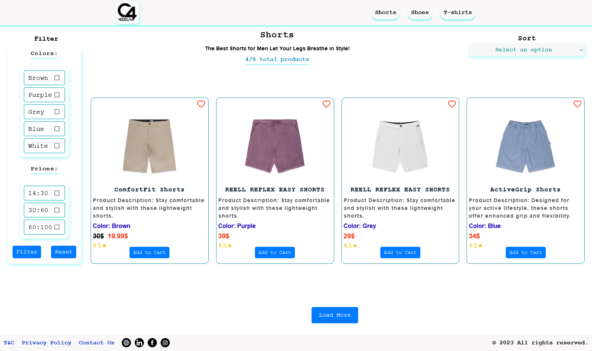
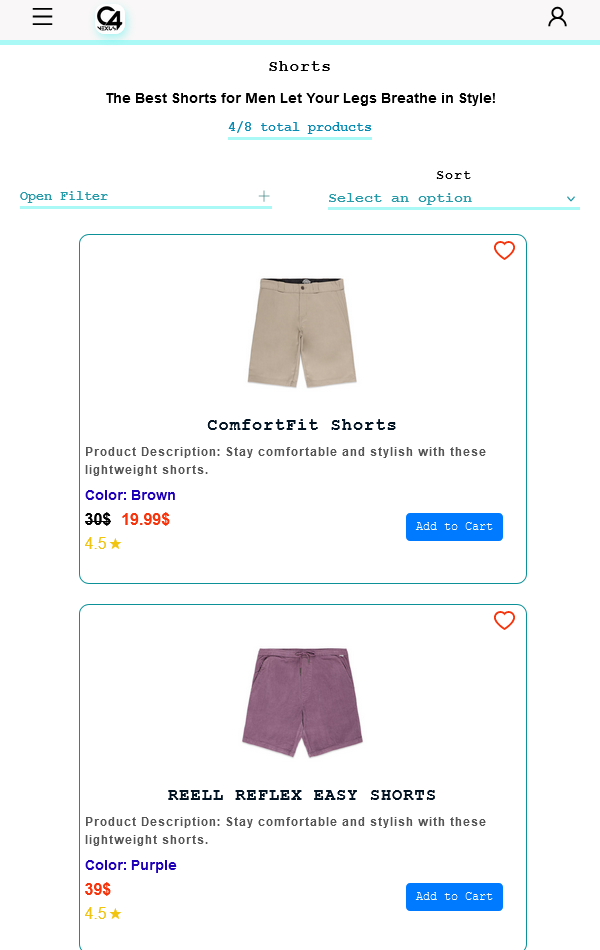
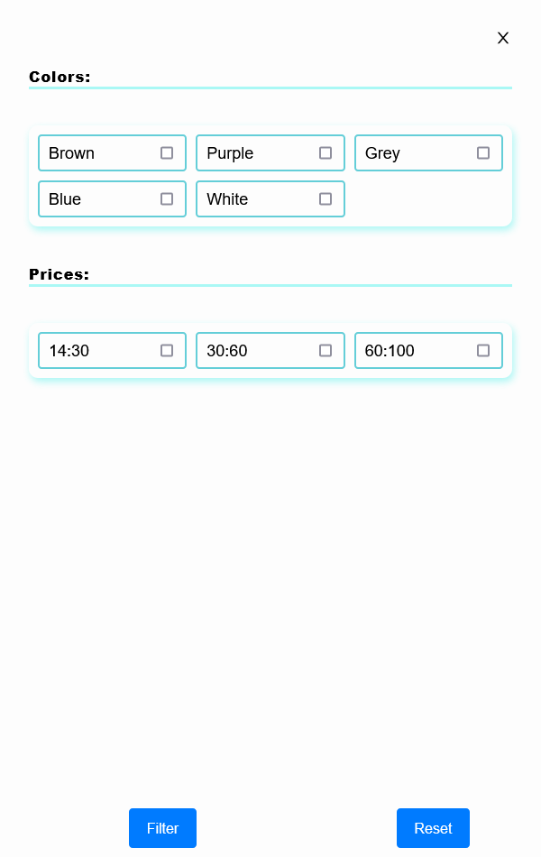
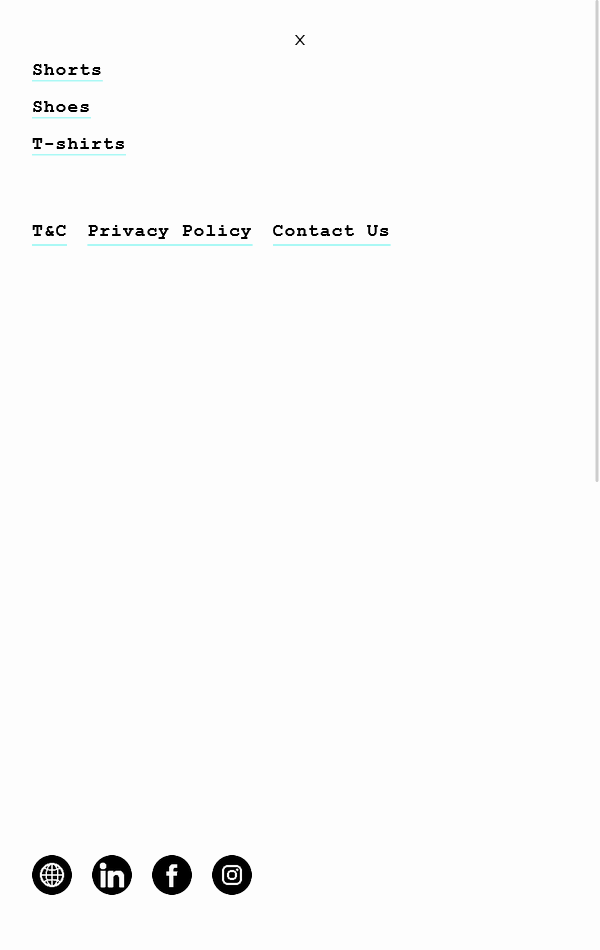

<h1 align="center"><i>C4 nexus task </i></h1>

"This app is a stock for products, including shoes, t-shirts, and shorts. The application is built with React and can be started by running 'npm start' in the terminal.
The app features three main pages, each dedicated to a specific stock category. Users can easily filter and sort data, as well as view the title and total count sections for each category. Additionally, a container with 4 rows and a 'load more' button is available, allowing users to load additional items.
With its user-friendly interface and functionalities, this app provides an excellent way to manage and explore different stock options in one place." 

<h3 align="center"><i>Challenges: </i></h3>
<i><b>"I am facing a challenge to write CSS that does not interfere with other elements on the page. Ensuring that my CSS styles do not break existing elements is a top priority."</b></i>

<h4 align="center"><i>Stack: </i></h4>
<i><b>React - 18.2.0, </b></i>
<i><b>React - Icons 4.10.1, </b></i>
<i><b>Node -  v18.14.0</b></i>

  

   
  
   

